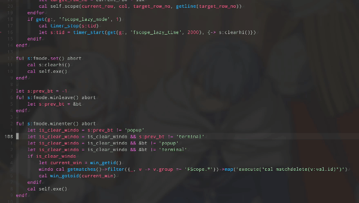
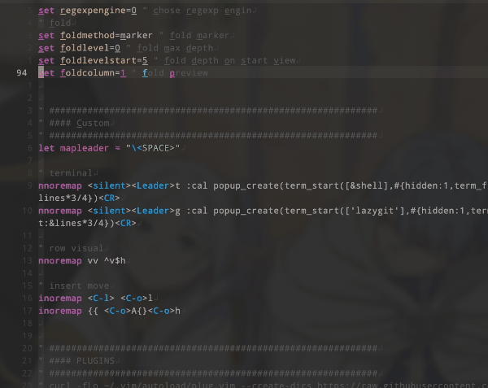
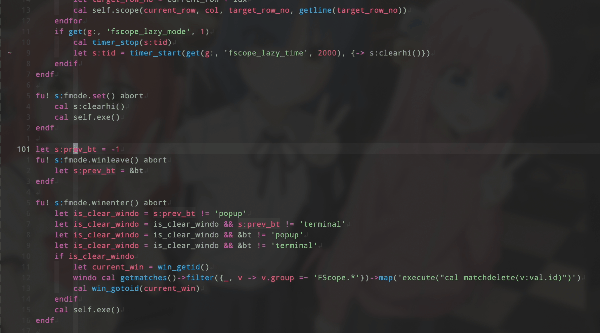

# vim-fscope-around
inspired by [quick-scope](https://github.com/unblevable/quick-scope).

Highlight `f-char` not only current row, around row


And lazy mode, disappear highlight 2 sec after cursor moved by default.


After `H` `M` `L` `5 row move`, target char must be highlighted.

with [vim-anchor5](https://github.com/serna37/vim-anchor5), [clever-f](https://github.com/rhysd/clever-f.vim)

Provide smooth cursor move with also edgemotion

with [vim-anchor5](https://github.com/serna37/vim-anchor5), [edgemotion](https://github.com/haya14busa/vim-edgemotion), [clever-f](https://github.com/rhysd/clever-f.vim)

# installation
```vim
Plug 'serna37/vim-fscope-around'
```

# usage
```vim
" keymaps sample
nnoremap <silent><Leader><Leader>fa <Plug>(fscope-around-activate)
nnoremap <silent><Leader><Leader>fd <Plug>(fscope-around-deactivate)
nnoremap <silent><Leader><Leader>fs <Plug>(fscope-around-toggle)

" commands
" active
:FScope
" deactive
:FScope!
" toggle
:FScope!!
```

# custom
overrite in your `.vimrc`
```vim
" highlight priority (default 16)
let g:fscope_highlight_priority = 16
" target range (default 5)
let g:fscope_around_row = 5
" active on start vim (default 1)
let g:fscope_init_active = 1
" lazy mode (default 1) -> highlight disappear 3 sec after cursor moved
let g:fscope_lazy_mode = 1
" highlight disappear time (default 3 sec)
let g:fscope_lazy_time = 2000

" color
hi FScopeCurrentRowPrimary ctermfg=204 cterm=underline
hi FScopeCurrentRowSecondary ctermfg=81 cterm=underline
hi FScopeAround cterm=underline
aug fmode_colors
    au!
    au ColorScheme * hi FScopeCurrentRowPrimary ctermfg=204 cterm=underline
    au ColorScheme * hi FScopeCurrentRowSecondary ctermfg=81 cterm=underline
    au ColorScheme * hi FScopeAround cterm=underline
aug END
```
# license
[MIT](./LICENSE)
